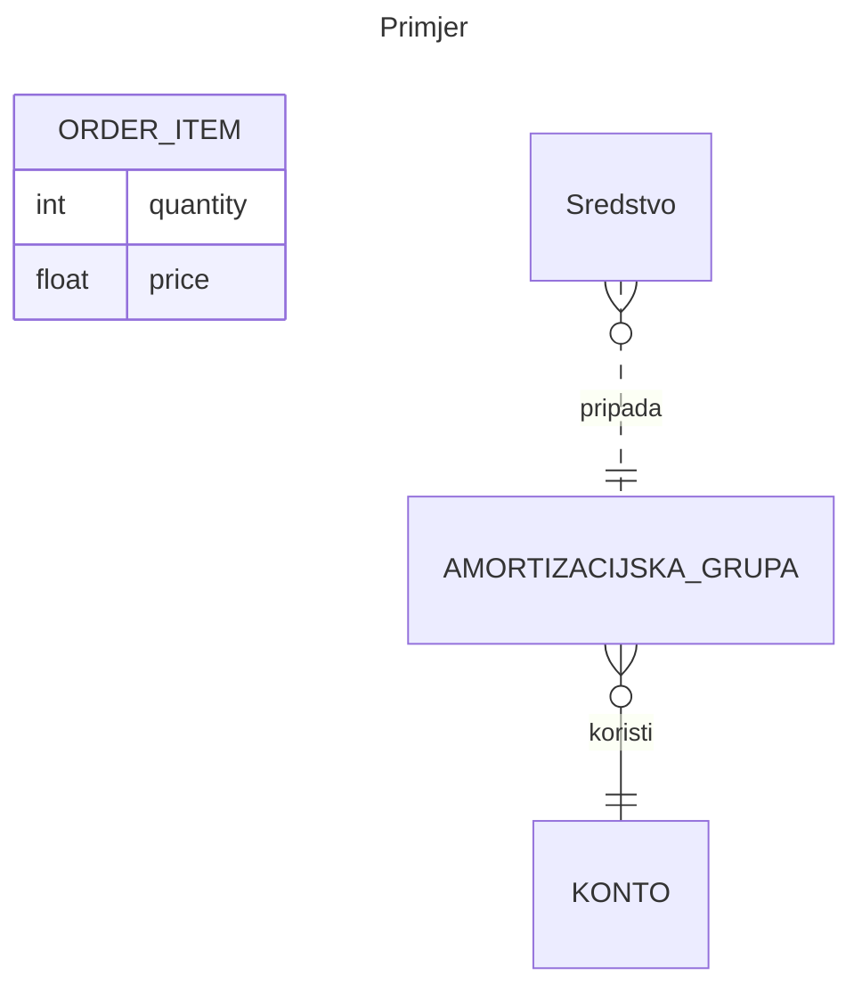

[[baze - seminar - imovina.canvas]]

Implementirati primjer baze podataka za Evidencija imovine

Za evidenciju dugotrajne imovine neke tvrtke, treba zabilježiti podatke o **sredstvu**:

**inventarni broj**, naziv-opis, datum aktivacije, status, trenutna vrijednost, nabavna vrijednost,godišnji iznos amortizacije, ukupni iznos amortizacija, datum amortizacije, amortizacijska grupa kojoj pripada, osnovica za izračun godišnje amortizacije.

Svakom sredstvu se dodjeljuje **amortizacijska grupa** koju određuje: 
- šifra, naziv grupe, stopa amortizacije u postotcima, osnovni **konto**

**Konto** ima atribute : šifra, naziv,status konta i tip konta. 
Tip konta može biti : dugovni ili potražni, a status konta može biti: aktivan, neaktivan.

**Status imovine** može bit neki od : u izradi, aktivno, rashodovano ili otpisano.

Za imovinu se bilježe i **transakacije**. I to **datum** transakcije i **vrsta** transakcije
**Vrste transakcija su : Nabava, Aktivacija, Rashod, Otpis,i godišnja amortizacija**

- Treba kreirati **ER**  dijagram, kao i DDL SQL strukturu baze, te pripremiti za svaki entitet nekoliko insert rečenica
	- **dijagram** ER
	- **DDL** struktura
	- inserti

- **Potrebno je kreirati sql** `VIEW` (pogled), koji će prikazivati pregled aktivne imovine sa podacima: inv.broj, opis, amoritzacijska grupa, nabavna vrijednost, trenutna vrijednost.

Potrebno je implementirati **plsql procedure** za: 
`Nabava`: 
označava kreiranje sredstva u evidenciji imovine, i dodaje zapis u tablicu transakcija 
`Aktivacija`: 
promjena statusa na sredstvu i datuma aktivacije, i dodaje zapis u tablicu transakcija
`Rashod`:
 promjena statusa imovine, i dodaje zapis u tablicu transakcija 
`Otpis`: 
promjena statusa imovine, i dodaje zapis u tablicu transakcija

`Amortizacija`
koja će umanjiti trenutnu vrijednost sredstva za iznos: osnovica amort. x stopa amortizacije, pri tome, istim tim iznosom uvećati ukupni iznos amortizacije na sredstvu. i dodaje zapis u tablicu transakcija
**Pri tome treba paziti da se sredstvo može amortizirati samo jednom godišnje.**

___
## Entiteti

- **sredstvo**(imovina)
	- naziv
	- opis
	- datum_aktivacije
	- status (u izradi, aktivno, rashodovanoj, otpisano)
	- trenutna_vrijednost
	- nabavna_vrijednost
	- godisnji_iznos_amortizacije
	- ukupni_iznos_amortizacija
	- datum_amortizacije
	- am. grupa id
- **am. grupa**
	- sifra
	- naziv
	- stopa amortizacije
	- osnovni konto
- **konto**
	- sifra
	- naziv
	- status_konta (aktivan, neaktivan)
	- tip_konta (dugovni, potrazni)
- **transakcije**
	- datum
	- vrsta (nabava, aktivacija, rashod, otpis, godisnja amortizacija)

___
[[Entity Relationship Diagrams]]




```sql
CREATE VIEW employee_info AS                        
SELECT name, salary                                  
FROM employees;   
```

## View

**Potrebno je kreirati sql** `view` (pogled), koji će prikazivati pregled aktivne imovine sa podacima:

```sql
CREATE OR REPLACE VIEW pregled_imovine AS
SELECT 
    sr.inventarni_broj,
    sr.opis,
    sr.amortizacijska_grupa,
    sr.nabavna_vrijednost,
    sr.trenutna_vrijednost,
    ag.naziv AS naziv_am_grupe,
    ag.sifra AS sifra_am_grupe
FROM sredstvo sr
 JOIN amortizacijska_grupa ag 
    ON sr.amortizacijska_grupa = ag.id;
```

## Funkcije i procedure :LiFunctionSquare:

Potrebno je implementirati **plsql procedure** za: 
`Nabava`: 
označava kreiranje sredstva u evidenciji imovine, i dodaje zapis u tablicu transakcija 
`Aktivacija`: 
promjena statusa na sredstvu i datuma aktivacije, i dodaje zapis u tablicu transakcija
`Rashod`:
 promjena statusa imovine, i dodaje zapis u tablicu transakcija 
`Otpis`: 
promjena statusa imovine, i dodaje zapis u tablicu transakcija

`Amortizacija`
koja će umanjiti trenutnu vrijednost sredstva za iznos: osnovica amort. x stopa amortizacije, pri tome, istim tim iznosom uvećati ukupni iznos amortizacije na sredstvu. i dodaje zapis u tablicu transakcija
**Pri tome treba paziti da se sredstvo može amortizirati samo jednom godišnje.**

### Nabava

označava kreiranje sredstva u evidenciji imovine, i dodaje zapis u tablicu transakcija.

```sql
CREATE OR REPLACE PROCEDURE nabava(
	naziv VARCHAR(32), opis VARCHAR(255), nabavna_vrijednost DECIMAL(10, 2), godisnji_iznos_amortizacije DECIMAL(10, 2), am_grupa NUMBER, inventarni_broj NUMBER
)
AS
BEGIN
	INSERT INTO sredstvo(naziv, opis, trenutna_vrijednost, nabavna_vrijednost, am_grupa, inventarni_broj)
		VALUES (:)
	
END
```

### aktivacija

```sql
-- `Aktivacija`:
-- promjena statusa na sredstvu i datuma aktivacije, i dodaje zapis u tablicu transakcija
CREATE OR REPLACE PROCEDURE aktivacija (
    p_sredstvo_id IN NUMBER
)
AS
BEGIN
    UPDATE sredstvo SET status = 'AKTIVNO' WHERE id = p_sredstvo_id;

    IF SQL%ROWCOUNT = 0 THEN
        RAISE_APPLICATION_ERROR(
            -20001,
            'Sredstvo s ID ' || p_sredstvo_id || ' ne postoji ili nije ažurirano.'
        );
    END IF;

    INSERT INTO transakcije (vrsta, entity_id) VALUES ('aktivacija', p_sredstvo_id);
    COMMIT;
EXCEPTION
    WHEN OTHERS THEN
        ROLLBACK;
        RAISE;
END;
```
#### Logic Flow
```
START
  ↓
Update sredstvo.status = 'AKTIVNO'
  ↓
Was any row updated?
  ├── NO → Raise custom error
  └── YES
          ↓
Insert transaction log
          ↓
Commit
          ↓
END

If any error occurs:
  ↓
Rollback everything
  ↓
Re-raise error
```

====**primjer** poziva:
```sql
EXEC aktivacija(5);
```

### rashod
 
>  promjena statusa imovine, i dodaje zapis u tablicu transakcija 